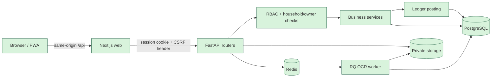
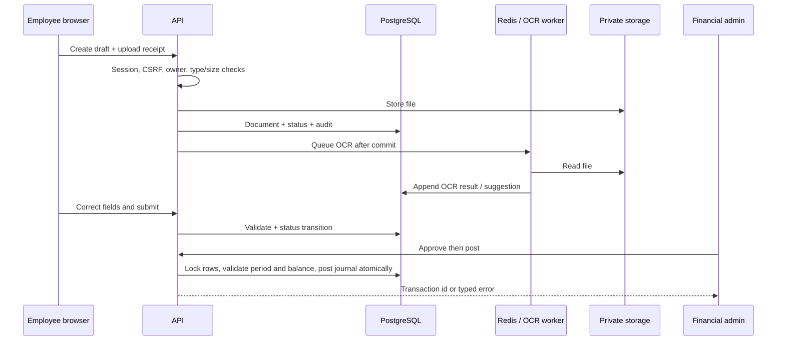
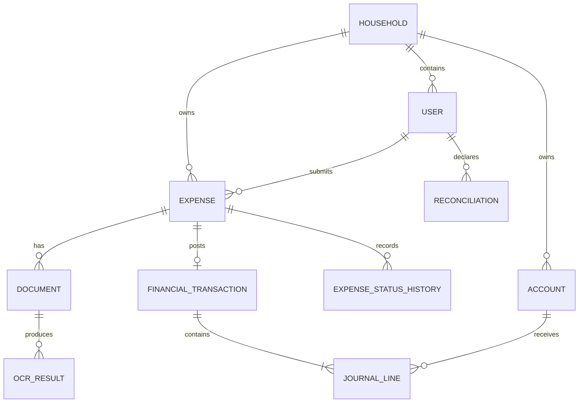
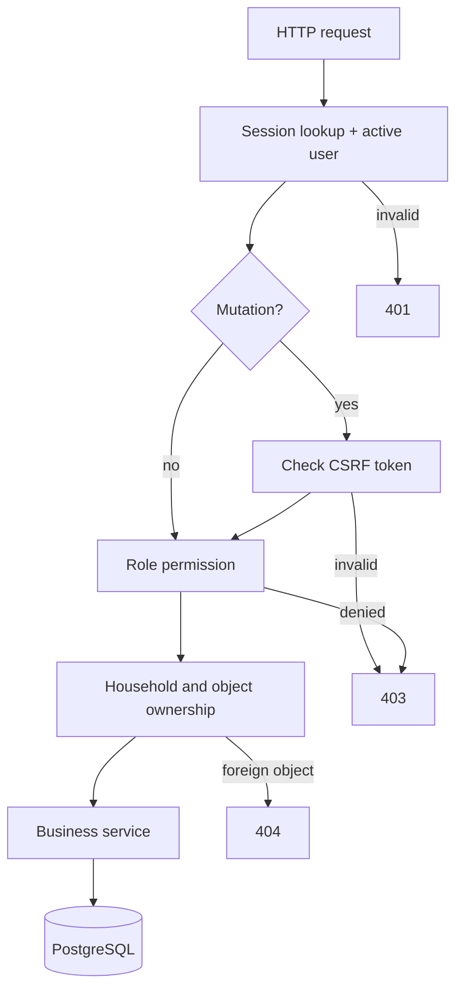
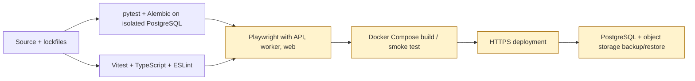

# Arkitektura / Architecture

Household Expense Manager (HEM) is a **financial control system** for household cash, not a receipt scanner.
Flow: admin funds a bank account -> employees withdraw cash at ATMs -> buy things -> photograph receipts -> admin approves -> admin posts to the ledger -> monthly reconciliation per employee.

## Components

| Component | Tech | Notes |
|---|---|---|
| `apps/web` | Next.js (App Router) + TypeScript + Tailwind + shadcn-style UI | Mobile-first PWA. Albanian UI via `src/i18n/sq.ts`. Holds **no** financial logic: it only renders numbers the API returns (as strings) and formats them as EUR. |
| `apps/api` | FastAPI + SQLAlchemy 2 + Alembic | All business rules, RBAC, ledger, OCR orchestration. Sync SQLAlchemy (psycopg3) for simple, correct transactions. |
| PostgreSQL 16 | | Source of truth. DB triggers enforce immutability of journal lines and append-only audit log. |
| Redis | | Job queue (RQ) for OCR, rate-limit counters. |
| Worker | `rq worker` (same image as API) | Runs OCR jobs asynchronously. |
| Object storage | S3-compatible (MinIO in Compose); local-disk backend for dev | Private bucket, signed temporary URLs only. |

The browser talks only to the Next.js origin; `/api/*` is proxied to FastAPI (same-origin, so HttpOnly SameSite cookies + CSRF header work without CORS).

## Backend layout (`apps/api/app`)

- `models.py` – ORM tables. `db.py` – engine/session.
- `services/ledger.py` – the **only** code that writes `financial_transactions`/`journal_lines`. Validates balance, idempotency, closed periods, currency.
- `services/accounts.py` – chart-of-accounts helpers (bank, per-employee wallet, per-category expense, suspense, payable, bank-fees, opening equity).
- `services/operations.py` – business operations (funding, ATM withdrawal, cash return, transfer, reimbursement) expressed as ledger postings.
- `services/expenses.py` – expense state machine + posting rules + refunds.
- `services/reconciliation.py` – monthly reconciliation computed from the ledger.
- `services/ocr/` – provider interface, tesseract/simulated providers, heuristic extractor, JSON schema validation.
- `services/storage.py`, `services/audit.py`, `services/security.py` (hashing, sessions, rate limit), `services/reports.py` (CSV/XLSX/PDF).
- `routers/*` – thin HTTP layer; authorization via `rbac.py`.

## Key design decisions

1. **Ledger is the only balance source.** No stored balances; `balance = SUM(debit - credit)` per account (with optional `as_of`).
2. **Money is `NUMERIC(18,4)` / `Decimal`** end to end; JSON carries money as strings.
3. **Separation of concerns for expenses**: OCR (suggests) -> human confirms/submits -> admin approves -> admin posts. Each is a separate transition and endpoint. OCR code has no import path to the ledger.
4. **Multi-household**: every business row carries `household_id`; every query is scoped by the caller's household.
5. **Currency-ready**: lines store `currency`, `amount`, `fx_rate`, `amount_base`. Phase 1 posts EUR only (rate 1) and rejects other currencies.
6. **Real vs simulated** is explicit: see `OCR_PIPELINE.md` and README.

## Rrjedhat dhe kufijtë e besimit pas ndryshimeve

All components above are implemented. The local storage backend and Tesseract/RapidOCR are real adapters; `OCR_PROVIDER=simulated` is a **test-only simulation**. No service-to-service integration with the three other ZIP projects is implemented.

OCR failures keep the document and let a person enter fields manually. Retry is available only to the owner or an admin; auditors have read-only access. Corrections compare against the most recent successful OCR result. No OCR path posts to the ledger.

The ledger uses `NUMERIC(18,4)`, balanced journal lines, unique idempotency keys within a household, account row locks, closed-period checks and database triggers that prevent edits to posted entries. Reversals append new transactions. Financial writes remain in `services/ledger.py`; migrations are in `apps/api/alembic/versions`. Monthly reconciliation derives balances from journal lines, records declarations and can post a difference to suspense.

`GET /api/health` is a process liveness check. `GET /api/ready` checks PostgreSQL and returns `503` on failure without exposing connection details. Production startup rejects the default secret and insecure session cookies; deploy behind HTTPS with `COOKIE_SECURE=true`. The test fixture destroys the `public` schema only after `TEST_DATABASE_URL` and `HEM_ALLOW_TEST_DB_RESET=1` identify a disposable test database.

The API and web checks are configured in `.github/workflows/checks.yml` and described in `docs/TEST_STRATEGY.md`. This new CI workflow has **not run on GitHub** in this delivery. Playwright, Compose smoke test, deployment and restore remain **manual/unverified**. No production migration or deployment was performed.

## Ndryshimet e këtij versioni

- OCR retry now enforces the same write permission as expense creation, closing an auditor write path.
- Corrections use the latest successful OCR suggestion, so audit evidence matches the value a person corrected.
- Test schema reset needs explicit opt-in and a database name marked as test.
- Production refuses an insecure cookie setting; readiness separately probes the database.
